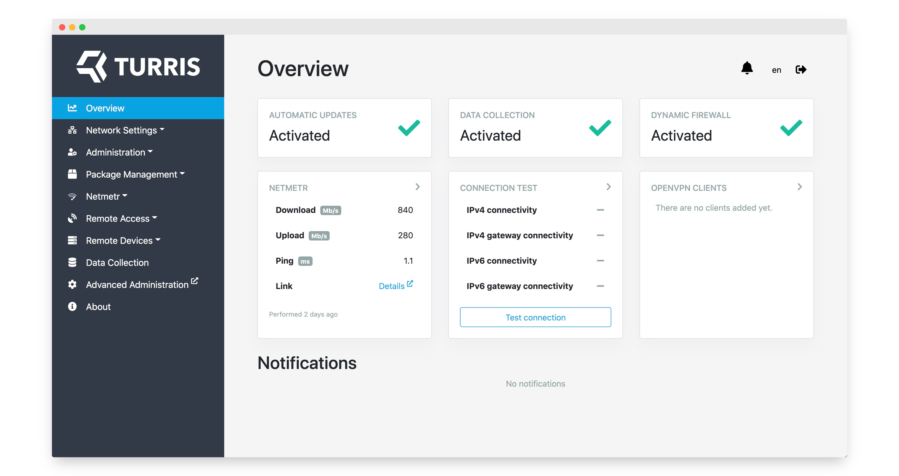

<div align="center">
   <p>
      <a href="https://gitlab.nic.cz/turris/reforis/">
      
      </a>
   </p>
</div>
<div align="center">
   <p>
      <strong>
      A simple web interface for <a href="https://docs.turris.cz/basics/models/" target="_blank">Turris</a> routers
      </strong>
   </p>
</div>
<div align="center">
   <p>
      <a href="https://gitlab.nic.cz/turris/reforis/reforis/-/jobs/">
         
      </a>
      <a href="https://hosted.weblate.org/projects/turris/reforis/">
         
      </a>
      <a href="https://github.com/prettier/prettier">
         
      </a>
   </p>
</div>
<div align="center">
   <p>
      reForis means redesigned Foris, and it is the latest and the most user-friendly interface for Turris routers.
   </p>
</div>
<div align="center">
   <p>
      <a href="docs/assets/reforis_screenshot.png" target="_blank">
      
      </a>
   </p>
</div>

## Features

-   **Modern architecture** — reForis underlying codebase is built with a tiny
    layer of Flask, React.js, Bootstrap 4 as a base for styling, and is compiled
    with Webpack, bringing excellent possibilities for extension and
    customization.

-   **Modular** — the interface of reForis is modular, supporting various
    plugins that can be installed over time by users to broaden the
    possibilities of what they can do with their router.

-   **Responsive** — built from the ground up to work on all sorts of devices –
    from mobile phones to widescreens. The underlying fluid layout will always
    adapt perfectly to the available screen space.

-   **International** — thanks to many contributors, reForis includes
    translations for more than 10 languages and offers community [to contribute](https://docs.turris.cz/geek/contributing/translation/)
    via web-based continuous localization tool Weblate.

-   **Accessible** — reForis provides extensible keyboard navigation and
    semantic markup, including role attributes and landmarks. Furthermore, the
    layout is entirely based on `rem` values, respecting the user's default font
    size.

## Supported Devices

-   [x] Turris Shield
-   [x] Turris Omnia
-   [x] Turris MOX
-   [x] Turris 1.x

## Development

The development of reForis is possible only on Turris devices due to specific
software and hardware usage. Some environment (Docker container), with Turris
routers hardware emulation, may be created in the future.

## Documentation

reForis has extensive documentation. It's simple to build via:

```bash
make prepare-docs
make docs
```

Then you can open HTML documentation in `./docs/build/index.html`.

## Plugins

It is also possible to extend reForis functionality with plugins.\
For more information about the development of plugins, see [reForis
documentation](#documentation) and [`reforis_diagnostics` demonstration
plugin](https://gitlab.nic.cz/turris/reforis/reforis-diagnostics).

## Contributing

All contributions are welcome!\
Please take a look at [CONTRIBUTING.md](CONTRIBUTING.md)
